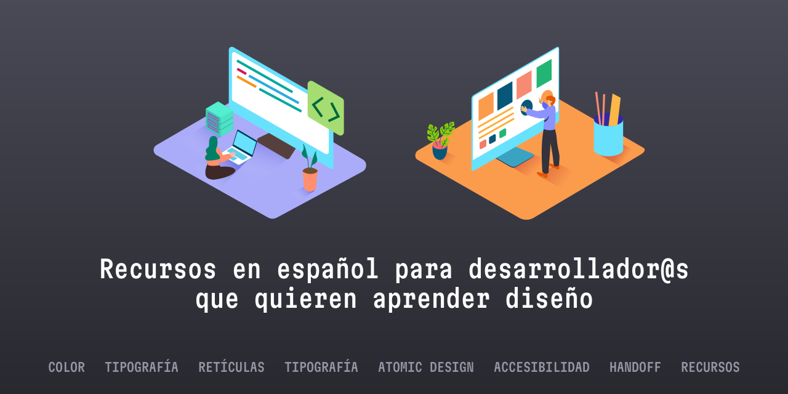

# Aprende diseño UX/UI (siendo un perfil de desarrollo)

> El roadmap que necesitas para entender mejor el diseño y desarrollar mejores productos digitales.

Este repositorio contiene una lista seleccionada de recursos para ayudarte a aprender sobre el diseño de interfaces y de experiencia del usuario. Incluye recursos como artículos, tutoriales, vídeos y cursos. Todo en español :)

## Color

- [Paletas de colores para diseño UI en solo 2 pasos](https://www.uifrommars.com/crear-paletas-de-color-diseno-ui/) - Para crear una buena paleta de color solo necesitas 1 color principal, 1 color acento, 4 colores semánticos y 4 colores neutros.

- [Guía de color HSL](https://www.uifrommars.com/que-es-hsl/) - El modo de color HSL es más intuitivo que HEX, RGB o RGBA, ya que permite tener más flexibilidad a la hora de crear paletas de color.

## Tipografía

- [Cómo escoger tipografías](https://www.uifrommars.com/como-escoger-tipografias/) - Cinco pasos para seleccionar la mejor tipografía de Google Fonts para el tipo de proyecto en el que estás trabajando.

- [Jerarquía tipográfica](https://www.uifrommars.com/jerarquia-tipografica-que-es-ejemplos/) - Los básicos de la jerarquía tipográfica para que los textos se lean y se entiendan bien.

## Retículas y 8pt grid

- [Conceptos básicos de las retículas](https://www.uifrommars.com/mejora-tu-diseno-ui-utilizando-reticulas/) - En pocas palabras: qué son y por qué deberían importarte.

- [Retícula de 8pt](https://www.uifrommars.com/reticula-8pt-que-es-para-que-sirve/) - Aprende (o recuerda) por qué se suele utilizar una retícula de 8pt para diseñar y desarrollar productos digitales.

## Atomic Design y tokens

- [Qué es el Atomic Design](https://www.uifrommars.com/atomic-design-ventajas/) - Un buen proceso basado en átomos, moléculas, organismos, plantillas y páginas para diseñar mejor y facilitar el desarrollo.

- [Qué son los Design Tokens y para qué sirven](https://www.uifrommars.com/design-tokens-que-son-ventajas/) - El santo grial del diseño atómico. Ventajas de utilizar design tokens y cómo implementarlos.

## Accesibilidad

- [Principios de la accesibilidad](https://www.uifrommars.com/como-disenar-web-app-accesible/) - Conocer los principios de diseño te permitirá detectar los errores en los que puedan caer los perfiles de diseño de tu equipo. Conoce qué es WCAG, A11y y conceptos como el ratio y el contraste.

- [Herramientas para comprobar la accesibilidad](https://www.uifrommars.com/7-herramientas-accesibilidad-disenadores/) - Extensiones y herramientas para que puedas asegurarte de que estás desarrollando algo que será accesible.

## Proceso de trabajo

- [Trabaja con casos de uso](https://www.uifrommars.com/casos-de-uso/) - Una cosa es que lo que has desarrollado funcione. Otra muy diferente es que realmente esté resolviendo casos de uso y necesidades para los usuarios.

- [Shape Up](https://www.uifrommars.com/que-es-shape-up/) - Aprende los básicos de esta metodología de Basecamp enfocada en trabajar proyectos bien definidos y delimitados en ciclos de seis semanas. Porque el desarrollo tiene mucha incertidumbre y, a veces, no tiene sentido seguir sprints u otros métodos.

- [Happy Path y Edge Cases](https://www.uifrommars.com/que-es-happy-path/) - Empieza siempre con el camino fácil, el que no tiene errores, pero no te olvides de los casos extremos... porque pasar, pasan.

- [Toma de requisitos](https://www.uifrommars.com/como-hacer-un-buen-brief/) - Esta parte es vital, porque las user stories no siempre están completas o contienen toda la información que necesitas.

## Trabajar con perfiles de diseño

- [Product Trio, la estructura perfecta](https://www.uifrommars.com/que-es-product-trio/) - Trabaja mano a mano con product managers y product designers, creando un triunvirato que evite repetir trabajo o ralentizarlo.

- [Tipos de estructuras en el equipo](https://www.uifrommars.com/estructuras-equipos-diseno/) - En función de cómo esté estructurado el equipo de diseño con el que trabajes tu trabajo desarrollando será más (o menos) fácil.

- [Design Critiques](https://www.uifrommars.com/que-es-design-critique-como-hacerlas/) - Aunque puedan parecer enfocadas a perfiles de diseño, si participas en ellas mejorarás el trabajo resultante. Tu enfoque como desarrollador/a es importante.

- [Comunicación efectiva](https://www.uifrommars.com/comunicacion-efectiva-diseno/) - Lo que se cuenta en el artículo es común para cualquier persona que trabaje en el sector tecnológico. Conoce cuáles son las barreras más comunes y las cuatro estrategias que puedes seguir para comunicarte mejor.

- [Cómo dar y recibir feedback sin morir en el intento](https://www.uifrommars.com/como-dar-recibir-feedback/) - Lo que dice el título: ni todo el feedback es malo, ni hay que ponerse siempre a la defensiva.

- [Diseña poco, comparte mucho](https://www.uifrommars.com/ciclos-de-feedback/) - Cómo conseguir que el equipo de diseño te haga actualizaciones periódicas en lugar de enviarte el diseño finalizado y cerrado al final.

## Handoff

- [Cómo hacer un buen handoff al equipo de desarrollo](https://www.uifrommars.com/como-hacer-handoff-diseno/) - Hacer un buen handoff es un arte, y no todos los perfiles de diseño lo hacen bien. Conoce qué puedes pedirles ;)

## Recursos gratuitos

- [SVG Repo](https://www.svgrepo.com/) - Más de 500.000 iconos en SVG bajo licencia abierta.

- [Material Icons](https://fonts.google.com/icons) - Los iconos de Google Material Design.

- [Color Hunt](https://colorhunt.co/) - Utiliza palabras clave para generar paletas de color que funcionen.

- [Eva Design System](https://colors.eva.design/) - Crea automáticamente los colores semánticos a partir del color de la marca.

- [Componentes UI open-source](https://uiverse.io/) - Como indica el nombre, aquí encontrarás más de 4.000 componentes de UI en CSS y Tailwind.

- [Checklist Design](https://www.checklist.design/) - Asegúrate de que te envían las cosas como deberían...

- [Frontend Checklist](https://frontendchecklist.io/) - Listas para asegurarte de que estás considerando aspectos como la accesibilidad, performance, etc.

## Sistemas de diseño

- [Acorn (Firefox)](https://acorn.firefox.com/latest/acorn-aRSAh0Sp)

- [Carbon (IBM)](https://carbondesignsystem.com/)

- [Garden (Zendesk)](https://garden.zendesk.com/)

- [Geist (Vercel)](https://vercel.com/geist/introduction)

- [Lexicon (Liferay)](https://liferay.design/lexicon/)

- [Lightning (Salesforce)](https://www.lightningdesignsystem.com/)

- [Material Design (Google)](https://m3.material.io/)

- [Mixpanel (Mixpanel)](https://design.mixpanel.com/)

- [MongoDB (MongoDB)](https://www.mongodb.design/#/ui-design-system/welcome)

- [Pajamas (GitLab)](https://design.gitlab.com/)

- [Polaris (Shopify)](https://polaris.shopify.com/)

- [Primer (GitHub)](https://primer.style/)

- [Protocol (Mozilla)](https://protocol.mozilla.org/)

- [Spectrum (Adobe)](https://spectrum.adobe.com/)

- [Vanilla (Ubuntu)](https://vanillaframework.io/)

- [Yoga (Gympass)](https://gympass.github.io/yoga/)

## Libros

- [Diseño desde Marte](https://disenodesdemarte.com/) - El primer manual de diseño de producto digital en español. Ideal si quieres aprender "qués es el diseño", cómo trabajan y cómo puedes trabajar mejor con ellos.

- [Better web typography for a better web](https://amzn.to/4caHpKS) - Está en inglés, pero es el mejor libro que puedes comprar si quieres entender tanto la parte visual como la parte de código.

- [Psicología del color](https://amzn.to/3v48vTv) - Un libro clásico si quieres entender mejor el uso del color y por qué transmiten sensaciones y emociones.

- [Sistema de retículas](https://amzn.to/3IZwiHz) - Aunque está enfocado para perfiles de diseño, es un libro esencial para comprender qué son las retículas, cómo se diseñan y qué límites tienen.

- [No me hagas pensar](https://amzn.to/3IEy9RH) - Sirve tanto para perfiles de diseño como para perfiles de desarrollo: en los productos digitales no hay que complicar excesivamente las cosas.

- [Idea, producto, negocio](https://amzn.to/4afnuIT) - Para aquellos perfiles de desarrollo que quieran aprender mejor qué es esto del "negocio" y cómo tener mejores ideas para participar en sesiones de ideación o hacer buenas propuestas.
